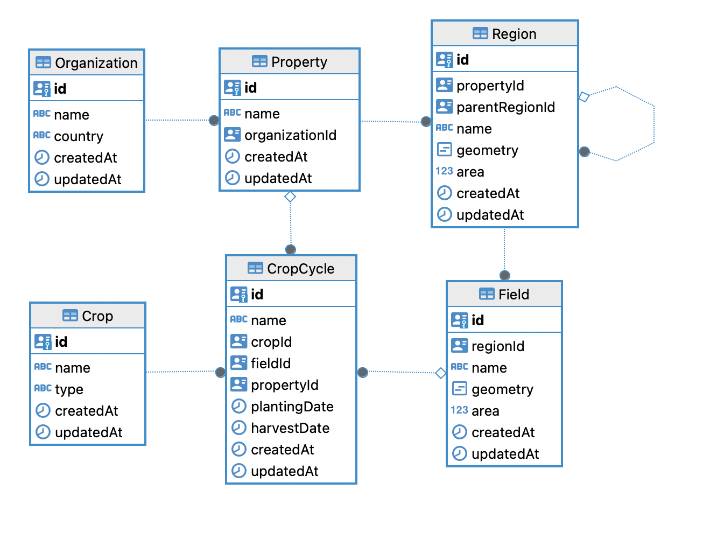

## Documentation

### Define Requirements

- Need to develop node js an app that offers common functionality for digital agriculture apps.
- Create REST API

### Technogy Stack Selection and Engineering Practice

- Primary
    - Node JS and Expreess JS
    - Typescript
    - SSO
        - Passport js and Passport Github
        - Express Session
    - Logger
        - Winston
- Testing
    - Jest
- Dtabase
    - PostgreSQL
    - ORM - Sequelize
- Git
    - Github
    - Github Action
- Code Quality and Vulnerability Scan
    - Snyk (Local snyk CLI)
    - Sonarqube (Local sonarlint)

### Database Design
- Entity
    - Organization
    - Property
    - Region
    - Field
    - Crop
    - CropCycle
- Mapping
    - One Organization has many Properties
    - One Property has many Regions
    - One Region has many Fields
    - Region have Sub Region
    - One Crop has many CropCycles
    - Cropcycle Map to Field or Property (Assumming based on description provided)

- ER Diagram

### Design API endpoints

- Organization:
    - An organization is a master entity that has a set of properties. It groups and controls all the resources involved in agriculture, such as crops and seasons.
    - GET `/v1/organizations` Get a list of all organizations.
    - POST `/v1/organizations` Create a new organization.
    - GET `/v1/organizations/{organizationId}` Get details of a specific organization.
    - PUT `/v1/organizations/{organizationId}` Update details of a specific organization.
    - DELETE `/v1/organizations/{organizationId}` Delete a specific organization.

- Property:
    -  A property represents a farm with a set of regions and fields. An organization can have multiple properties.
    - GET `/v1/properties` Get a list of all properties.
    - POST `/v1/properties` Create a new property.
    - GET `/v1/properties/{propertyId}` Get details of a specific property.
    - PUT `/v1/properties/{propertyId}` Update details of a specific property.
    - DELETE `/v1/properties/{propertyId}` Delete a specific property.

- Region
    - Regions represent geographical structures and can contain fields or other regions. 
    - GET `/v1/regions` Get a list of all regions.
    - POST `/v1/regions` Create a new region.
    - GET `/v1/regions/{regionId}` Get details of a specific region.
    - PUT `/v1/regions/{regionId}` Update details of a specific region.
    - DELETE `/v1/regions/{regionId}` Delete a specific region.

- Field
    - A field is a specialization of a region and represents an actual land area with a defined geometry.
    - GET `/v1/fields` Get a list of all fields.
    - POST `/v1/fields` Create a new field.
    - GET `/v1/fields/{fieldId}` Get details of a specific field.
    - PUT `/v1/fields/{fieldId}` Update details of a specific field.
    - DELETE `/v1/fields/{fieldId}` Delete a specific field.

- Crop
    - A crop represents a type of plant that can be grown and harvested.
    - A field is a specialization of a region and represents an actual land area with a defined geometry.
    - GET `/v1/crops` Get a list of all crops.
    - POST `/v1/crops` Create a new crop.
    - GET `/v1/crops/{cropId}` Get details of a specific crop.
    - PUT `/v1/crops/{cropId}` Update details of a specific crop.
    - DELETE `/v1/crops/{cropId}` Delete a specific crop.

- Crop Cycle
    - A crop cycle is responsible for grouping a list of fields with a crop assigned over time.
    - GET `/v1/crop-cycles` Get a list of all crop-cycles.
    - POST `/v1/crop-cycles` Create a new crop-cycle.
    - GET `/v1/crop-cycles/{cropCycleId}` Get details of a specific crop-cycle.
    - PUT `/v1/crop-cycles/{cropCycleId}` Update details of a specific crop-cycle.
    - DELETE `/v1/crop-cycles/{cropCycleId}` Delete a specific crop-cycle.    

### Develop an API server

- Database
    - Created a Models folder to place the database model, and it is based on sequelize.
    - Extracted config from the.env variable and exported from the `index.ts` file
- Components
    - Components are divided into two parts: `Controller` and `Service`.
    - The service is responsible for communicating with the respective database model.
- Routes
    - Register the controller and its register method for REST endpoints.
- Common Services
    - This service is accountable for performing common operations between multiple database models.
    - We can inject this into the component service and access its method in the controller from the component service.
- Unit Test Cases
    - Created unit test cases using Jest with 90+ code coverage.
    - Tried to cover positive and negative scenerio
    - Code Coverage Report
      
